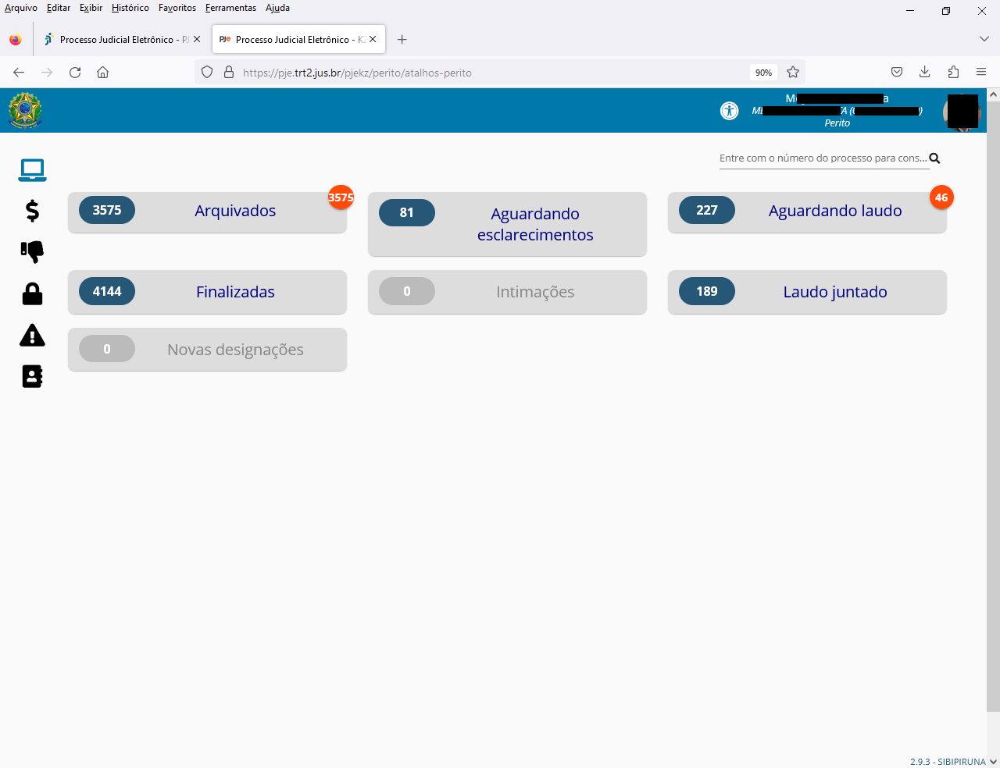

# batch-read-pje

## 🚀 Projeto
Extração de dados em lotes do [PJe](https://pje.trt2.jus.br/primeirograu/login.seam), plataforma de acesso do [TRT2 - Tribunal Regional do Trabalho](https://ww2.trt2.jus.br).

<div align="center">
  
</div>
<div align="center">
  
</div>
<div align="center">
  
</div>

## 🗂️ Utilização

### 🐑🐑 Clonando o repositório:

```bash
  $ git clone url-do-projeto.git
```

### 🔑 Configurando o ambiente:
- Adicione o cookie com as autorizações de acesso ao seu arquivo <code>.env</code>, de acordo com o arquivo <code>.env.example</code>.

### ▶️ Rodando o App:

```bash
  $ cd read-batch-pje       #change to that directory 
  $ node pje.js             #start the project
```

Docs:
```
100XXXX-48.2014.5.02.0317;bdXXXce XX/09/2014 Ata da Audiência
100XXXX-42.2014.5.02.0316;65XXX26 XX/04/2018 Sentença
100XXXX-83.2013.5.02.0322;44XXX82 XX/04/2013 Ata da Audiência
100XXXX-53.2014.5.02.0321;aaXXXc3 XX/02/2015 Ata da Audiência
100XXXX-26.2014.5.02.0320;54XXXe6 XX/08/2014 Ata da Audiência
```

Partes:
```
100XXXX-18.2014.5.02.0317;MARCOS XXXX;TOP XXXX EIRELI
100XXXX-33.2016.5.02.0311;FRANCIMAR XXXX;PREXXXX LTDA - ME,WAXXX LTDA  - ME,TRXXXX - EIRELI
100XXXX-38.2017.5.02.0501;SIMONE XXXX;DHL XXXX LTDA.
100XXXX-93.2017.5.02.0311;ELIANE XXXX;NXXXX LTDA
100XXXX-07.2015.5.02.0311;NILDA XXXX;ATXXXX LTDA
```


## ⭐ Like, Subscribe, Follow!
Curtiu o projeto? Marque esse repositório com uma Estrela ⭐!